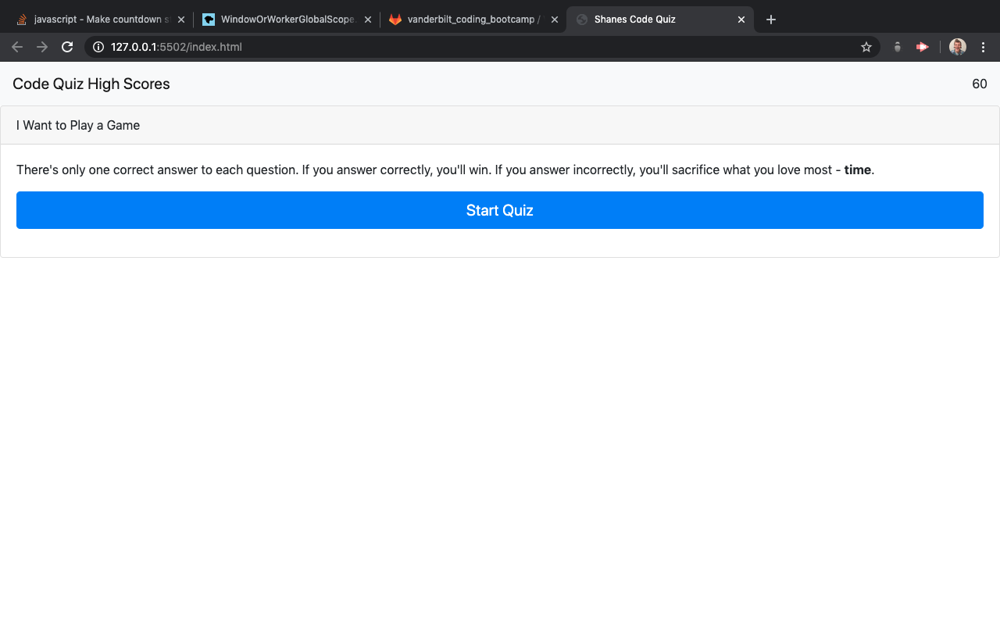

# image


If this doesn't work, there is a screen shot of the project in the assets folder. Still couldn't figure out how to add an image. 

# link

https://shanerunnels.github.io/shanescodequiz/

# description

To start off, I did not finish this project. I didn't manage my time very well this week, so I ran out. 
Speaking of time, please wait until the timer is done because I couldn't figure out how to jump to the end
when the questions have run out. 
But I do believe that the code that you'll find is clean and at least meets some of the criteria. 
Like always, even though I did not finish it, I hope you'll appreciate the movie reference in it. 

# criteria

AS A coding bootcamp student
I WANT to take a timed quiz on JavaScript fundamentals that stores high scores
SO THAT I can gauge my progress compared to my peers
```

Acceptance Criteria

```
GIVEN I am taking a code quiz
WHEN I click the start button
THEN a timer starts and I am presented with a question
WHEN I answer a question
THEN I am presented with another question
WHEN I answer a question incorrectly
THEN time is subtracted from the clock
WHEN all questions are answered or the timer reaches 0
THEN the game is over
WHEN the game is over
THEN I can save my initials and score
```
